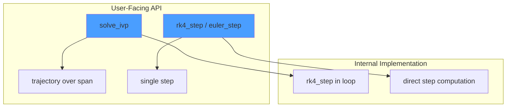

# Explicit ODE Integration API for Janus

Designing a clean API for explicit fixed-step ODE integrators that supports dual-mode (numeric/symbolic) execution while respecting Janus's existing integration infrastructure.

## Background: Current State

| File | Purpose | Backend |
|------|---------|---------|
| [`Integrate.hpp`](file:///home/tanged/sources/janus/include/janus/math/Integrate.hpp) | `quad()`, `solve_ivp()`, `solve_ivp_symbolic()`, `solve_ivp_expr()` | RK4 (numeric), CVODES (symbolic) |
| [`IntegrateDiscrete.hpp`](file:///home/tanged/sources/janus/include/janus/math/IntegrateDiscrete.hpp) | `integrate_discrete_intervals()`, Simpson/cubic methods | Numeric only (discrete samples) |

**Key Observations:**
1. `solve_ivp()` internally uses RK4 but is a **trajectory solver** (returns full history over span)
2. No explicit **single-step** integrators exposed (Euler, RK2, RK4 step)
3. No symbolic-compatible stepping API for simulation loops
4. Missing: Butcher tableau abstraction for extensibility

---

## Architecture: Unified Integration Stack



**Key Insight**: `solve_ivp` becomes a convenience wrapper that calls `rk4_step` in a loop. This gives users:
- **Low-level control**: `rk4_step()` for custom simulation loops
- **High-level convenience**: `solve_ivp()` for trajectory generation

---

## Proposed Solution: `IntegratorStep.hpp`

Create a **single-step integrator API** that works in both numeric and symbolic modes, complementing the existing trajectory-based `solve_ivp`.

### API Design

```cpp
namespace janus {

// Single-step integrators (return x_{n+1} given x_n, t_n, dt)
template <typename Scalar, typename Func>
JanusVector<Scalar> euler_step(Func&& f, const JanusVector<Scalar>& x, Scalar t, Scalar dt);

template <typename Scalar, typename Func>
JanusVector<Scalar> rk2_step(Func&& f, const JanusVector<Scalar>& x, Scalar t, Scalar dt);

template <typename Scalar, typename Func>
JanusVector<Scalar> rk4_step(Func&& f, const JanusVector<Scalar>& x, Scalar t, Scalar dt);

// ... higher order variants (rk45 with error estimate)
}
```

### Use Cases

| Use Case | Solution |
|----------|----------|
| Trajectory optimization (single shooting) | `solve_ivp()` or manual `rk4_step()` loop |
| Fixed-time-step simulation | `rk4_step()` in user loop |
| Symbolic graph generation | `rk4_step<MX>(...)` with symbolic `Scalar` |
| Euler integration (fast, low accuracy) | `euler_step()` |

---

## Proposed Changes

### [NEW] [IntegratorStep.hpp](file:///home/tanged/sources/janus/include/janus/math/IntegratorStep.hpp)

New header with single-step explicit integrators:

1. **`euler_step`** - Forward Euler (1st order)
2. **`rk2_step`** - Heun's method / Midpoint method (2nd order)
3. **`rk4_step`** - Classic 4th-order Runge-Kutta
4. **`rk45_step`** - Dormand-Prince with embedded error estimate (for adaptive stepping)

All templated on `Scalar` for dual-mode compatibility.

#### Implementation Pattern

```cpp
template <typename Scalar, typename Func>
JanusVector<Scalar> rk4_step(Func&& f, const JanusVector<Scalar>& x, Scalar t, Scalar dt) {
    // f(t, x) -> dx/dt
    auto k1 = f(t, x);
    auto k2 = f(t + dt * 0.5, x + dt * 0.5 * k1);
    auto k3 = f(t + dt * 0.5, x + dt * 0.5 * k2);
    auto k4 = f(t + dt, x + dt * k3);
    
    return x + (dt / 6.0) * (k1 + 2.0 * k2 + 2.0 * k3 + k4);
}
```

> [!IMPORTANT]
> All arithmetic uses Janus types directly. `Scalar * JanusVector<Scalar>` relies on Eigen's scalar multiplication which works for both `double` and `MX`.

---

### [MODIFY] [Integrate.hpp](file:///home/tanged/sources/janus/include/janus/math/Integrate.hpp)

Refactor `solve_ivp` to use the new step functions internally:

```diff
 template <typename Func>
 OdeResult<double> solve_ivp(Func &&fun, std::pair<double, double> t_span, 
                             const NumericVector &y0, int n_eval = 100, ...) {
     // ... setup code ...
     
     for (int i = 1; i < n_eval; ++i) {
         double t = result.t(i - 1);
         double dt = dt_base / substeps;
 
         for (int s = 0; s < substeps; ++s) {
-            // RK4 step (inline implementation)
-            NumericVector k1 = fun(t, y);
-            NumericVector k2 = fun(t + dt / 2, y + dt / 2 * k1);
-            NumericVector k3 = fun(t + dt / 2, y + dt / 2 * k2);
-            NumericVector k4 = fun(t + dt, y + dt * k3);
-            y = y + dt / 6.0 * (k1 + 2 * k2 + 2 * k3 + k4);
+            // Use shared step implementation
+            y = rk4_step(fun, y, t, dt);
             t += dt;
         }
         result.y.col(i) = y;
     }
 }
```

This change:
- Eliminates code duplication between `solve_ivp` and `rk4_step`
- Makes `solve_ivp` behavior consistent with standalone `rk4_step`
- Allows future extension (e.g., `solve_ivp(..., method="euler")`)

---

### [MODIFY] [janus.hpp](file:///home/tanged/sources/janus/include/janus/janus.hpp)

Add include for the new header:
```cpp
#include "janus/math/IntegratorStep.hpp"
```

---

### [NEW] [test_integrator_step.cpp](file:///home/tanged/sources/janus/tests/math/test_integrator_step.cpp)

Test suite covering:
- **Numeric mode**: Compare step outputs against analytical solutions
- **Symbolic mode**: Verify graph generation and evaluation
- **Order verification**: Confirm convergence rates (Euler ~O(h), RK4 ~O(h⁴))

---

## User Review Required

> [!IMPORTANT]
> **API Naming Convention**: Should step functions follow:
> - `euler_step`, `rk2_step`, `rk4_step` (explicit) OR
> - `step::euler`, `step::rk2`, `step::rk4` (nested namespace)

> [!NOTE]
> **Scope Boundaries**: This plan focuses on **explicit** fixed-step methods. Implicit methods (Backward Euler, implicit midpoint) and adaptive stepping (RK45 with step control) are excluded for now.

---

## Verification Plan

### Automated Tests

Run test suite after implementation:
```bash
# Build and run tests (assuming nix environment)
./scripts/ci.sh
```

Specific test file:
```bash
# After entering dev shell
./scripts/dev.sh
# Then build and run
./scripts/build.sh && ./scripts/test.sh
```

### Test Cases to Implement

| Test | Description | Verification |
|------|-------------|--------------|
| `EulerStepExponential` | dy/dt = -y, y(0) = 1 | Compare `euler_step` to ~1 + h*(-1) = 1-h |
| `RK4StepExponential` | dy/dt = -y, y(0) = 1 | Compare to `exp(-h)` with 1e-6 tolerance |
| `RK4StepHarmonic` | Harmonic oscillator state | Verify over one period |
| `SymbolicRK4Step` | Same ODE symbolically | `janus::eval()` matches numeric |
| `ConvergenceOrderEuler` | Error vs step size | Confirm O(h) |
| `ConvergenceOrderRK4` | Error vs step size | Confirm O(h⁴) |

---

## Alternatives Considered

### Option A: Butcher Tableau Abstraction
```cpp
struct ButcherTableau { /* a, b, c coefficients */ };
template <typename Scalar>
JanusVector<Scalar> runge_kutta_step(const ButcherTableau& tableau, ...);
```
**Pros**: Maximum extensibility, supports any RK method
**Cons**: More complex API, overkill for common use cases

### Option B: Enum-Based Method Selection
```cpp
enum class RKMethod { Euler, RK2, RK4, RK45 };
template <typename Scalar>
JanusVector<Scalar> rk_step(RKMethod method, ...);
```
**Pros**: Single entry point
**Cons**: Runtime dispatch, less type-safe

### Recommendation

Start with **explicit function names** (`euler_step`, `rk4_step`) for simplicity and compile-time method selection. Add Butcher tableau abstraction later if extensibility is needed.
