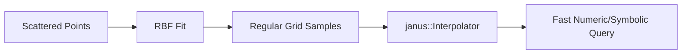

# Scattered Data Interpolation (Sparse Table Lookup)

Add support for interpolating over unstructured/scattered point cloud data.

## Background

The existing `janus::Interpolator` requires data on regular N-D grids. Many engineering applications have **scattered** data:

- Wind tunnel test points at arbitrary Mach/alpha combinations
- CFD results at non-uniform mesh points
- Experimental measurements at opportunistic conditions

| Feature | Gridded Interpolant | Scattered Interpolant |
|---------|---------------------|----------------------|
| Data Structure | Regular axis-aligned grid | Arbitrary point cloud |
| Performance | Fast (tensorially separable) | Slower (requires triangulation or RBF) |
| Dimensionality | Requires plaid structure | Handles arbitrary shapes |
| Symbolic Mode | Native CasADi support | Requires special handling |

---

## Proposed Approach: RBF Resampling

Following the [AeroSandbox pattern](file:///home/tanged/sources/janus/reference/AeroSandbox/aerosandbox/modeling/interpolation_unstructured.py):

1. **Construction time**: Fit RBF to scattered data, evaluate onto regular grid
2. **Query time**: Use fast gridded `Interpolator` for lookups

This maintains **symbolic compatibility** - the CasADi graph only sees the gridded interpolant.



---

## Proposed Changes

### Core

#### [NEW] [ScatteredInterpolator.hpp](file:///home/tanged/sources/janus/include/janus/math/ScatteredInterpolator.hpp)

```cpp
namespace janus {

/// @brief Radial basis function kernel types
enum class RBFKernel {
    ThinPlateSpline, ///< r² log(r) - smooth, good default
    Multiquadric,    ///< sqrt(1 + (ε*r)²) - adjustable shape
    Gaussian,        ///< exp(-(ε*r)²) - localized
    Linear           ///< r - simple, fast
};

/// @brief Interpolator for scattered (unstructured) N-D data
///
/// Fits RBF to scattered points, resamples to grid, then delegates
/// to gridded Interpolator for symbolic-compatible queries.
///
/// @example
/// ```cpp
/// // Scattered wind tunnel data: (Mach, alpha) -> CL
/// NumericMatrix points(100, 2);  // 100 test points, 2D input
/// NumericVector values(100);      // CL values
/// 
/// ScatteredInterpolator cl_table(points, values);
/// 
/// // Query (numeric or symbolic)
/// NumericVector query(2);
/// query << 0.8, 5.0;  // Mach=0.8, alpha=5°
/// double cl = cl_table(query);
/// ```
class ScatteredInterpolator {
public:
    /// @brief Construct from scattered N-D points
    /// @param points Data locations, shape (n_points, n_dims)
    /// @param values Function values at each point
    /// @param grid_resolution Points per dimension for resampling grid
    /// @param kernel RBF kernel type
    /// @param method Gridded interpolation method for final queries
    ScatteredInterpolator(
        const NumericMatrix& points,
        const NumericVector& values,
        int grid_resolution = 20,
        RBFKernel kernel = RBFKernel::ThinPlateSpline,
        InterpolationMethod method = InterpolationMethod::Linear
    );
    
    /// @brief Construct with per-dimension grid specification
    /// @param grid_points Explicit grid coordinates per dimension
    ScatteredInterpolator(
        const NumericMatrix& points,
        const NumericVector& values,
        const std::vector<NumericVector>& grid_points,
        RBFKernel kernel = RBFKernel::ThinPlateSpline,
        InterpolationMethod method = InterpolationMethod::Linear
    );
    
    /// @brief 1D convenience constructor
    ScatteredInterpolator(
        const NumericVector& x,
        const NumericVector& y,
        int grid_resolution = 50,
        RBFKernel kernel = RBFKernel::ThinPlateSpline
    );
    
    /// Evaluate at N-D point (numeric or symbolic)
    template <JanusScalar Scalar>
    Scalar operator()(const JanusVector<Scalar>& query) const;
    
    /// Evaluate at scalar (1D only)
    template <JanusScalar Scalar>
    Scalar operator()(const Scalar& query) const;
    
    /// Get underlying gridded interpolator (for inspection)
    const Interpolator& gridded() const { return m_gridded; }
    
    /// Get reconstruction error (RMS at original points)
    double reconstruction_error() const { return m_reconstruction_error; }

private:
    Interpolator m_gridded;
    double m_reconstruction_error;
    
    /// Build RBF weights from scattered data
    void fit_rbf(const NumericMatrix& points, const NumericVector& values,
                 RBFKernel kernel);
    
    /// Evaluate RBF at grid points to create structured data
    NumericVector evaluate_rbf_on_grid(
        const std::vector<NumericVector>& grid,
        const NumericMatrix& centers,
        const NumericVector& weights,
        RBFKernel kernel
    );
};

} // namespace janus
```

**Key Design Decisions**:

1. **RBF at construction, gridded at query**: Symbolic graph only sees gridded interpolant
2. **Reconstruction error metric**: Helps user validate fit quality
3. **Thin plate spline default**: No shape parameter tuning needed
4. **Eigen-based RBF solve**: Uses existing `janus::solve()` for linear system

---

#### [MODIFY] [JanusMath.hpp](file:///home/tanged/sources/janus/include/janus/math/JanusMath.hpp)

```diff
 #include "janus/math/Interpolate.hpp"
+#include "janus/math/ScatteredInterpolator.hpp"
```

---

### Tests

#### [NEW] [test_scattered_interpolator.cpp](file:///home/tanged/sources/janus/tests/math/test_scattered_interpolator.cpp)

| Test Case | Description |
|-----------|-------------|
| `Basic1D` | Scattered 1D points, compare to analytic |
| `Basic2D` | 2D point cloud, verify reconstruction |
| `GridResolution` | Higher resolution → lower error |
| `KernelComparison` | Compare TPS, Multiquadric, Gaussian |
| `SymbolicCompat` | Symbolic evaluation creates proper graph |
| `SymbolicGradient` | AD gradient matches finite diff |
| `ReconstructionError` | `reconstruction_error()` reports correctly |
| `HighDim3D` | 3D scattered data |
| `BatchQuery` | Multiple query points |
| `EdgeCases` | Queries outside convex hull (extrapolation) |

---

#### [MODIFY] [CMakeLists.txt](file:///home/tanged/sources/janus/tests/CMakeLists.txt)

```diff
 add_executable(test_math 
     ...
     math/test_interpolate.cpp
+    math/test_scattered_interpolator.cpp
     math/test_rotations.cpp
```

---

## Implementation Details

### RBF Kernel Functions

```cpp
// φ(r) for each kernel type
inline double rbf_kernel(double r, RBFKernel kernel, double epsilon = 1.0) {
    switch (kernel) {
    case RBFKernel::ThinPlateSpline:
        return (r > 0) ? r * r * std::log(r) : 0.0;
    case RBFKernel::Multiquadric:
        return std::sqrt(1.0 + (epsilon * r) * (epsilon * r));
    case RBFKernel::Gaussian:
        return std::exp(-(epsilon * r) * (epsilon * r));
    case RBFKernel::Linear:
        return r;
    }
}
```

### RBF System Solve

Given N scattered points, solve for weights `w`:

```
Φ * w = f

where Φ[i,j] = φ(||p_i - p_j||)
```

Use `janus::solve(Phi, f)` to get weights.

---

## Verification Plan

### Automated Tests

```bash
./scripts/ci.sh
```

**Key numeric verification**:
- 1D quadratic: scattered points from y=x², verify < 1% error on grid
- 2D test function: f(x,y) = sin(x)*cos(y), verify reconstruction
- `reconstruction_error()` < tolerance for smooth functions

**Symbolic verification**:
```cpp
casadi::MX sym_x = casadi::MX::sym("x", 2);
SymbolicVector query(2);
query << sym_x(0), sym_x(1);

SymbolicScalar result = scattered_interp(query);
auto f = janus::Function("test", {sym_x}, {result});

// Verify gradient via CasADi jacobian
auto df = janus::jacobian(f);
```

### Manual Verification

None required.
