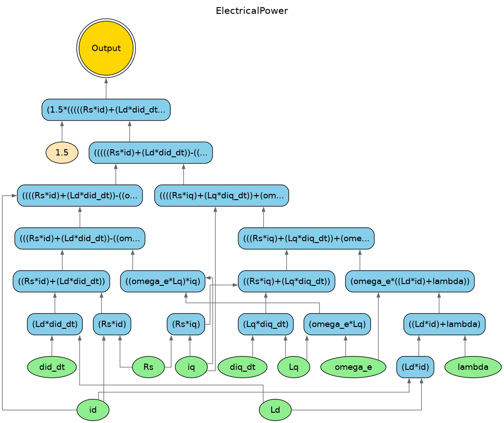

# Graph Visualization Guide

This guide explains how Janus uses **computational graphs** for symbolic computation and how to visualize them for debugging and understanding.

---

## What is a Computational Graph?

A **computational graph** is a directed acyclic graph (DAG) that represents mathematical expressions. Each node is either:

- **Input nodes** (leaves): Symbolic variables or constants
- **Operation nodes** (internal): Mathematical operations (+, *, sin, etc.)
- **Output node** (root): The final result

When you write symbolic expressions in Janus, CasADi builds a computational graph internally. This graph enables:

1. **Automatic differentiation** — Traverse the graph to compute gradients
2. **Code generation** — Compile the graph to efficient C code
3. **Optimization** — Symbolic solvers operate on the graph structure

### Example: Simple Expression

```cpp
auto x = janus::sym("x");
auto y = x * x + 2.0 * x + 1.0;  // Builds a graph with 5+ nodes
```

This creates a tree structure:

```
        (+)
       /   \
     (+)    1.0
    /   \
  (*)    (*)
  / \    / \
 x   x  2   x
```

---

## Visualizing Graphs in Janus

Janus provides three functions for graph visualization in `<janus/core/JanusIO.hpp>`:

| Function | Description |
|----------|-------------|
| `export_graph_dot(expr, filename)` | Export to DOT format |
| `render_graph(dot_file, output_file)` | Render DOT to PDF/PNG/SVG |
| `visualize_graph(expr, base)` | Convenience (export + render) |

### Basic Usage

```cpp
#include <janus/janus.hpp>

auto x = janus::sym("x");
auto expr = janus::sin(x) * x;

// Option 1: Two-step (export then render)
janus::export_graph_dot(expr, "my_graph", "SinExpression");
janus::render_graph("my_graph.dot", "my_graph.pdf");

// Option 2: One-step convenience
janus::visualize_graph(expr, "my_graph");  // Creates .dot and .pdf
```

> [!NOTE]
> Rendering requires **Graphviz** installed. In NixOS, it's included in the dev shell.

---

## Real Example: Electric Motor Power

The [graph_visualization.cpp](file:///home/tanged/sources/janus/examples/graph_visualization.cpp) example models a **Permanent Magnet Synchronous Motor (PMSM)**.

### The Model

```cpp
template <typename Scalar>
struct MotorModel {
    Scalar Rs, Ld, Lq, lambda, p, J, B;

    // Electrical power: P = 1.5 * (Vd*id + Vq*iq)
    Scalar electrical_power(Scalar Vd, Scalar Vq, Scalar id, Scalar iq) const {
        return 1.5 * (Vd * id + Vq * iq);
    }
};
```

### Building the Graph

```cpp
// Create symbolic motor parameters
auto Rs = janus::sym("Rs");
auto Ld = janus::sym("Ld");
// ... more parameters

MotorModel<janus::SymbolicScalar> motor{Rs, Ld, Lq, lambda, p, J, B};

// Compute voltage equations
auto Vd = motor.voltage_d(id, iq, did_dt, omega_e);
auto Vq = motor.voltage_q(id, iq, diq_dt, omega_e);

// Build power expression
auto P_elec = motor.electrical_power(Vd, Vq, id, iq);

// Visualize the computational graph
janus::visualize_graph(P_elec, "graph_power");
```

### The Generated Graph

The power expression `P = 1.5 * (Vd*id + Vq*iq)` expands to include all the intermediate terms from the voltage equations, creating a deep graph:



**Node colors:**
- 🟢 **Green ellipses**: Input variables (id, iq, Rs, Ld, etc.)
- 🟡 **Yellow ellipses**: Constants (1.5, etc.)
- 🔵 **Blue boxes**: Operations (multiply, add, subtract)
- 🟠 **Gold circle**: Output node

---

## Understanding the Graph Structure

### Inputs Flow Upward

The graph uses **bottom-to-top** layout (`rankdir=BT`):
- Inputs (variables and constants) are at the bottom
- Operations build upward
- The final output is at the top

### Shared Subexpressions

CasADi automatically detects **common subexpressions**. If `iq` appears in multiple places, the graph reuses the same node — this is a key optimization for automatic differentiation.

### Deep vs. Shallow Graphs

| Expression | Depth | Use Case |
|------------|-------|----------|
| `x + y` | 1 | Simple operations |
| `sin(x) * cos(y)` | 2 | Transcendental functions |
| `motor.voltage_d(...)` | 3-4 | Engineering models |
| `P_elec` (full motor) | 6+ | Nested function calls |

---

## Advanced: Jacobian Graphs

You can also visualize the graph of **derivatives**:

```cpp
auto T_e = motor.electromagnetic_torque(id, iq);

// Compute Jacobian: dT/d[id, iq]
auto dT_dq = janus::jacobian({T_e}, {id, iq});

// Visualize the derivative graph
janus::visualize_graph(dT_dq, "jacobian_graph");
```

The Jacobian graph shows how CasADi computes gradients by applying the chain rule symbolically.

---

## Practical Applications

1. **Debugging** — Verify your expression has the expected structure
2. **Optimization analysis** — See which variables affect the output
3. **Teaching** — Demonstrate automatic differentiation concepts
4. **Documentation** — Generate figures for papers and reports

---

## Running the Example

```bash
cd /path/to/janus
./scripts/build.sh
./build/examples/graph_visualization

# View generated graphs
xdg-open graph_power.pdf
xdg-open graph_dynamics.pdf
```

---

## See Also

- [Symbolic Computing Guide](symbolic_computing.md) — Symbolic mode fundamentals
- [graph_visualization.cpp](file:///home/tanged/sources/janus/examples/graph_visualization.cpp) — Full example source
- [JanusIO.hpp](file:///home/tanged/sources/janus/include/janus/core/JanusIO.hpp) — API reference
