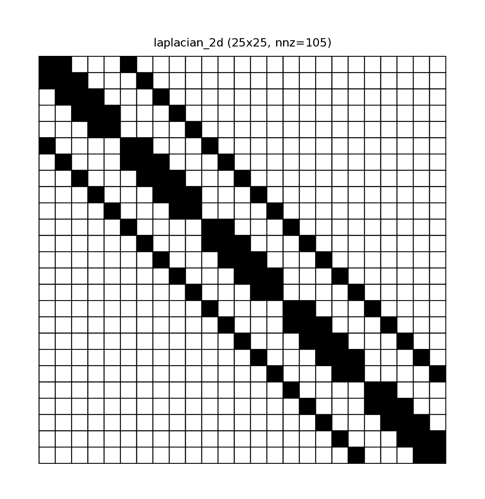

# Sparsity Introspection in Janus

Understanding the sparsity pattern of your Jacobian and Hessian matrices is crucial for high-performance optimization. Dense solvers scale poorly ($O(N^3)$), while sparse solvers (like MUMPS, MA57) scale much better, provided the problem structure is exploited.

Janus provides tools to visualize and analyze these patterns directly from your symbolic expressions, without needing to run a full optimization.

## The `SparsityPattern` Class

The core of this feature is `janus::SparsityPattern` (in `<janus/core/Sparsity.hpp>`). It wraps CasADi's sparsity logic but integrates seamlessly with Janus native types.

### Key Features
- **Query**: Check `nnz()` (number of non-zeros), `density()`, dimensions, etc.
- **Visualize**: Generate ASCII "spy plots" for console or high-quality PDFs for reports.
- **Analyze**: Extract patterns from symbolic expressions or Janus Functions.

## extracting Sparsity

You can extract sparsity in three main ways:

### 1. From Symbolic Expressions
If you have a symbolic expression $f(x)$, you can ask for the sparsity of its derivatives:

```cpp
auto x = janus::sym("x", 10);
auto f = ...; // some expression depending on x

// Jacobian sparsity (df/dx)
janus::SparsityPattern J_sp = janus::sparsity_of_jacobian(f, x);

// Hessian sparsity (d²f/dx²)
janus::SparsityPattern H_sp = janus::sparsity_of_hessian(f, x);
```

### 2. From `janus::Function`
If you have already compiled a function:
```cpp
janus::Function func(inputs, outputs);
auto sp = janus::get_jacobian_sparsity(func);
```

### 3. From CasADi Types directly
```cpp
janus::SparsityPattern sp(numeric_matrix); // Extract from NumericMatrix/DM
```

## Visualization

### ASCII Spy Plot
For quick debugging in the terminal, use `to_string()`:
```cpp
std::cout << sp.to_string() << std::endl;
```

Output:
```
Sparsity: 10x10, nnz=28 (density=28.000%)
┌──────────┐
│**........│
│***.......│
│.***......│
...
└──────────┘
```
Dots `.` represent zeros, asterisks `*` represent non-zeros.

### PDF Rendering (Graphviz)
For complex patterns or reports, generate a PDF grid visualization:
```cpp
sp.visualize_spy("my_pattern"); // Creates my_pattern.pdf
```
This renders a true "spy plot" where non-zeros are black squares.

## Example Walkthrough: `sparsity_intro.cpp`

The example `examples/intro/sparsity_intro.cpp` demonstrates four common structures found in optimization.

### 1. Simple Jacobian
Shows explicitly how dependencies map to non-zeros.
$f_0 = x_0^2$ depends only on $x_0$, so row 0 has non-zero at col 0.

### 2. Chain Structure (Tridiagonal)
```cpp
f = sum((x[i] - x[i+1])^2)
```
This optimization objective creates a tridiagonal Hessian. This "arrowhead" or band structure is typical in trajectory optimization (e.g., Direct Collocation) where each state depends only on its neighbors.

### 3. Independent Systems (Block Diagonal)
Two completely separate systems stacked together form a block-diagonal matrix. Solvers love this structure because it can be parallelized trivially. The example explicitly constructs this to show how Janus detects it.

### 4. 2D Laplacian (5-Point Stencil)
Typical in PDE constraints or grid-based problems. Each node $(i,j)$ depends on itself and its 4 neighbors (Up, Down, Left, Right).
The example uses `janus::sym_vec_pair` to easily handle 2D indexing while maintaining a valid symbolic input for the function:

```cpp
// 1. Create vector of symbols for easy indexing
auto [x_vec, x_mx] = janus::sym_vec_pair("x", n_vars);

// 2. Build equations using x_vec(k)
...

// 3. Create Function using raw x_mx
janus::Function f_pde({x_mx}, {janus::SymbolicScalar::vertcat(eqs)});
```

This structure produces a banded matrix with off-diagonal bands at distance $\pm 1$ and $\pm N$.


